## Salima EL HOU - SDIA 2
# Application de Gestion des Factures
# Mise en oeuvre d'une architecture micro-services

## Objectif
Créer une application basée sur une architecture micro-service qui permet de gérer les factures contenant des produits et appartenant à un client.

## Technologies Utilisées
- **Spring Boot** : Framework pour développer des applications Java basées sur des microservices.
- **Spring Cloud** : Pour gérer la configuration des services et la découverte.
    - **Eureka** : Service de découverte pour enregistrer et trouver des services.
    - **Spring Cloud Gateway** : Pour le routage des requêtes.
- **Open Feign** : Pour simplifier les appels REST entre microservices.
- **Spring Data JPA** : Pour la gestion des données avec une base de données relationnelle.
- **Hibernate** : Pour la gestion de la persistance des données.
- **Angular** : Framework pour développer l'interface utilisateur côté client.
- **Maven** : Pour la gestion des dépendances et la construction du projet.

## Tâches Réalisées
1. **Création des Microservices :**
    - **Customer-Service** : Gestion des informations clients.
    - **Inventory-Service** : Gestion des produits disponibles.
    - **Billing Service** : Traitement et gestion des factures.

2. **Configuration de Spring Cloud Gateway :**
    - Mise en place d'un point d'entrée unique pour toutes les requêtes.
    - Routing des requêtes vers les microservices appropriés.

3. **Intégration de Eureka Discovery :**
    - Enregistrement des microservices auprès d'Eureka pour la découverte des services.
    - Configuration de l'auto-découverte des microservices dans l'application.

4. **Implémentation d'Open Feign :**
    - Utilisation de Feign pour faciliter les appels REST entre les microservices.

5. **Création d'un Client Angular :**
    - Développement d'une interface utilisateur pour interagir avec les microservices.
    - Intégration des services REST pour afficher et gérer les informations.

    
## Demo

- **Première partie**
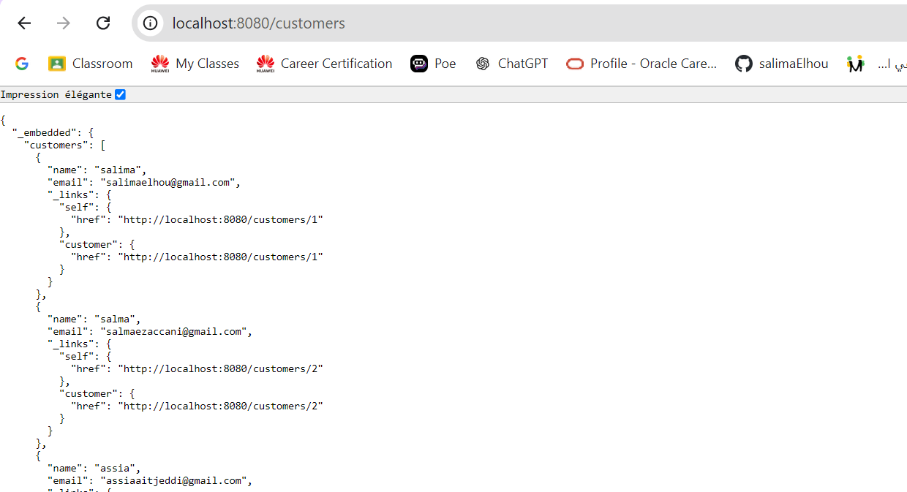
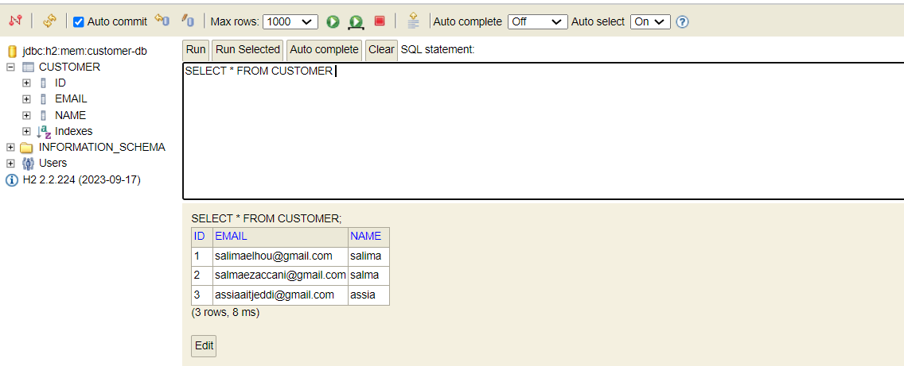
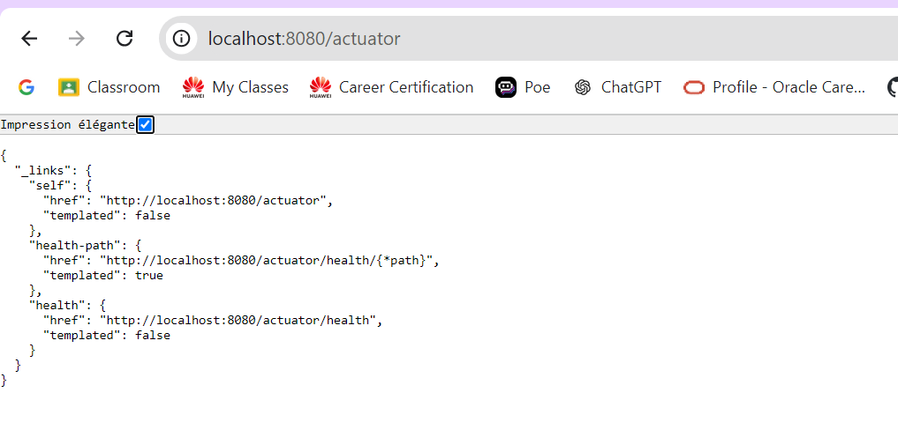
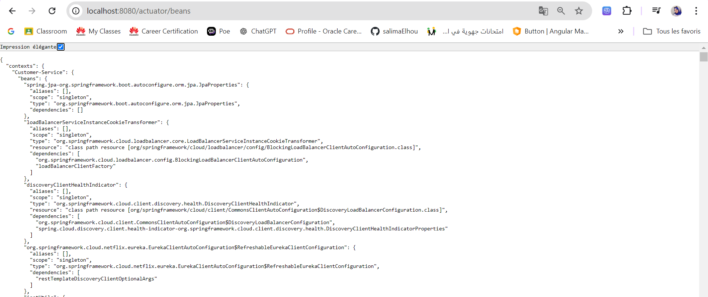
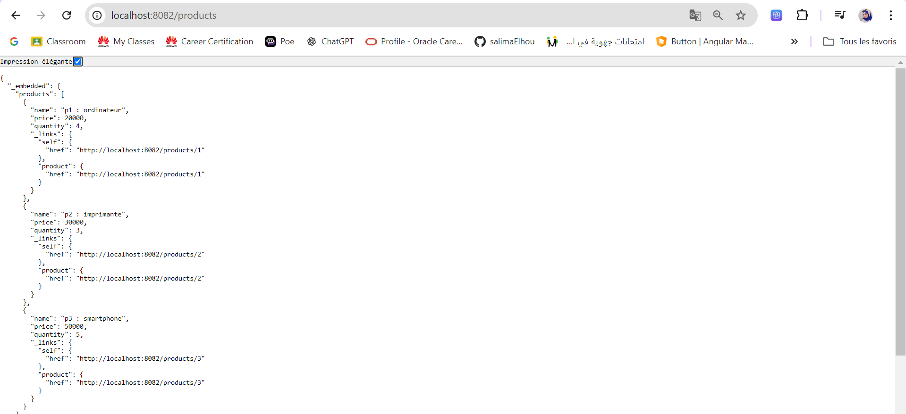
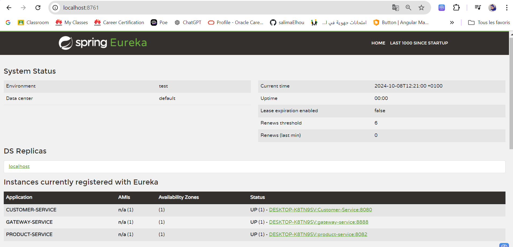
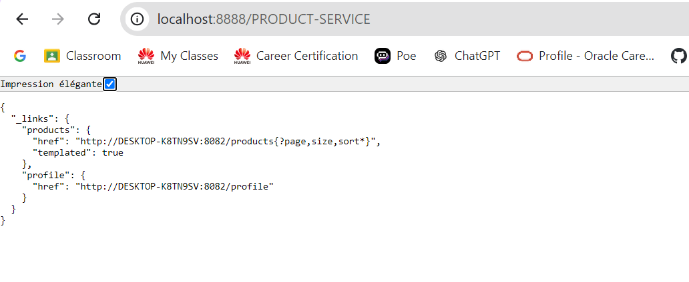

- **Deuxième Partie**
  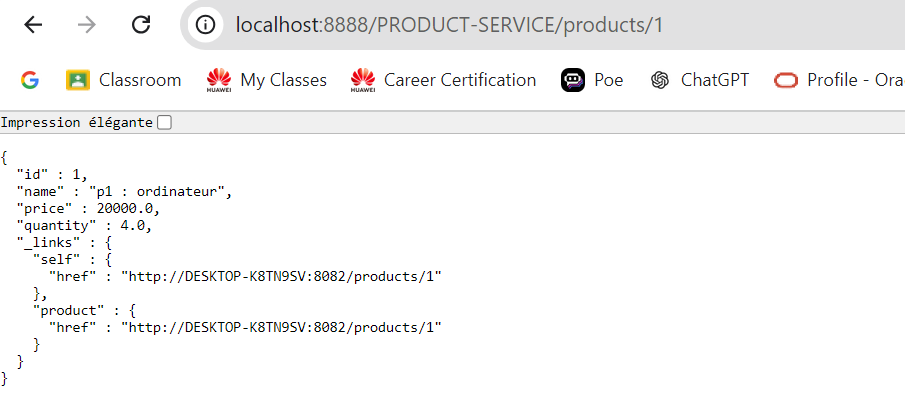
  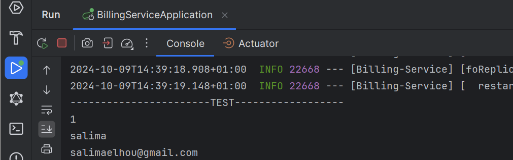
  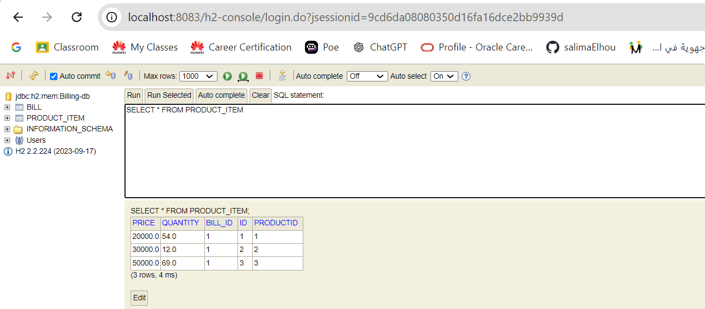
  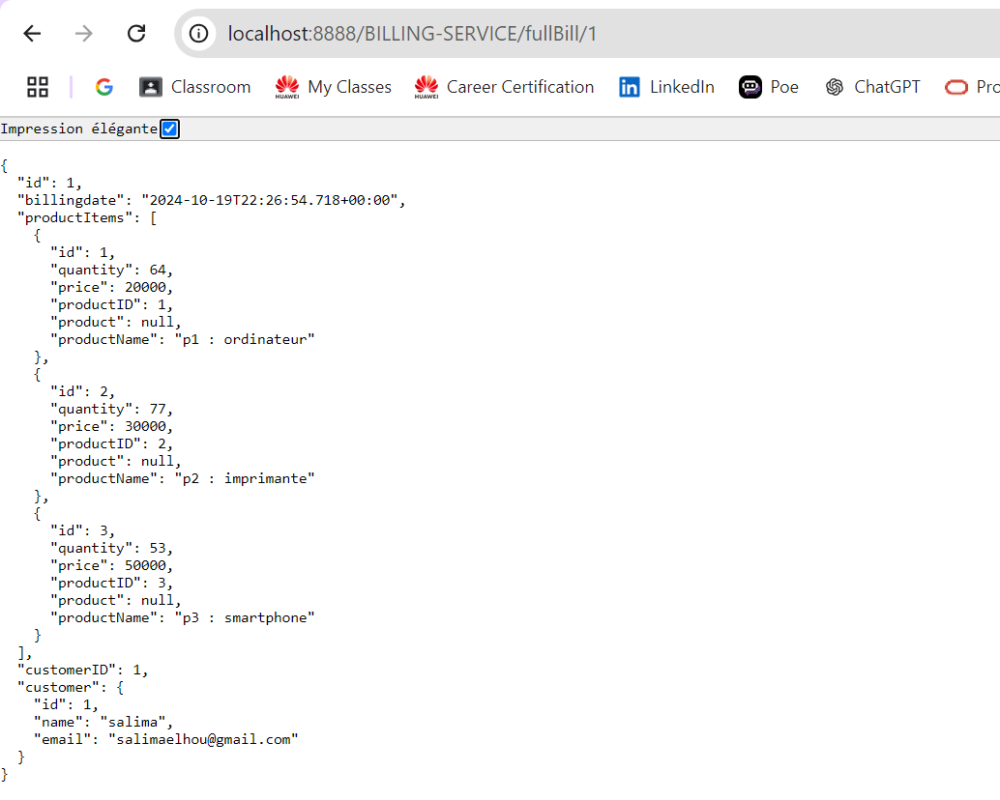
